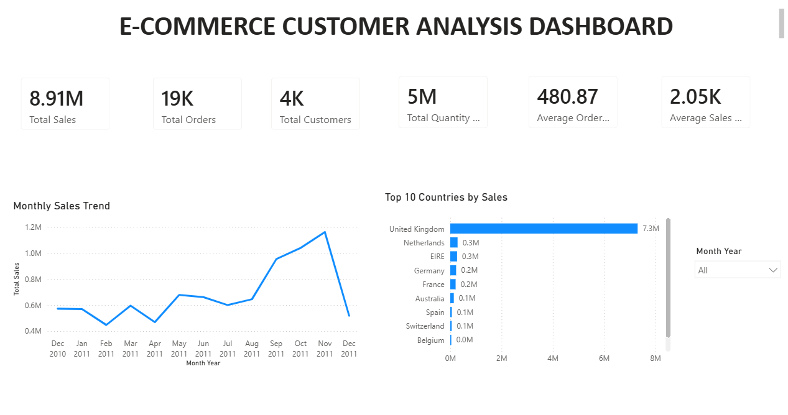
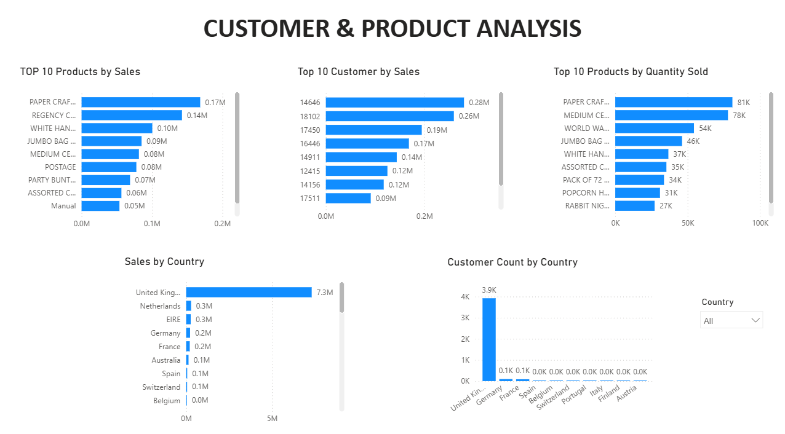
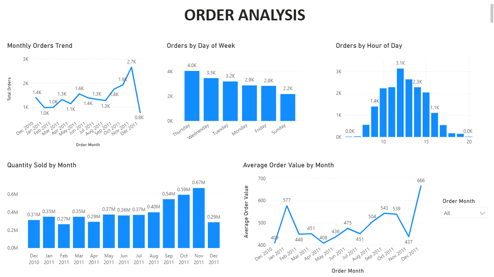
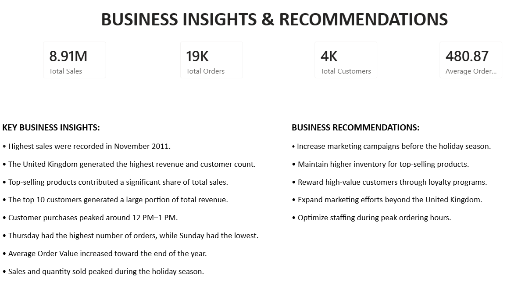

# 🛒 E-Commerce Customer Analysis Dashboard

## 📊 Dashboard Overview

## 📌 Project Overview

This project presents an interactive **Power BI dashboard** designed to analyze e-commerce sales, customer purchasing behavior, product performance, and order trends. The dashboard transforms raw transactional data into meaningful business insights, helping stakeholders make informed decisions through interactive visualizations and KPIs.

---

## 🎯 Business Problem

E-commerce businesses generate large volumes of transactional data, making it difficult to identify sales trends, customer behavior, and product performance. This dashboard addresses these challenges by providing a centralized view of key business metrics and actionable insights.

---

## 📂 Dashboard Pages

### 1️⃣ Executive Overview

Provides a high-level summary of business performance using KPIs and trend analysis.

**Key Highlights**
- Total Sales
- Total Orders
- Total Customers
- Total Quantity Sold
- Average Order Value
- Average Sales per Customer
- Monthly Sales Trend
- Top 10 Countries by Sales

**Screenshot**

---

### 2️⃣ Customer & Product Analysis

Analyzes customer purchasing behavior and product performance.

**Key Highlights**
- Top 10 Products by Sales
- Top 10 Customers by Sales
- Top 10 Products by Quantity Sold
- Sales by Country
- Customers by Country

**Screenshot**

---

### 3️⃣ Order Analysis

Analyzes ordering patterns across different time periods.

**Key Highlights**
- Monthly Orders Trend
- Orders by Day of Week
- Orders by Hour of Day
- Quantity Sold by Month
- Average Order Value by Month

**Screenshot**

---

### 4️⃣ Business Insights & Recommendations

Summarizes the most important findings and business recommendations.

**Key Highlights**
- Key Business Insights
- Business Recommendations
- Performance Summary

**Screenshot**

---

## 📈 Key KPIs

- 💰 Total Sales
- 🛍️ Total Orders
- 👥 Total Customers
- 📦 Total Quantity Sold
- 💳 Average Order Value
- 📊 Average Sales per Customer

---

## 📁 Dataset Information

- **Source:** Kaggle – Online Retail (E-Commerce) Dataset
- **Records:** 541,909 Transactions
- **Features:** Invoice Number, Product, Quantity, Unit Price, Customer ID, Country, Invoice Date

> **Note:** The dataset is not included in this repository due to GitHub file size limitations.

---

## 💡 Key Business Insights

- Highest sales were recorded in **November 2011**.
- The **United Kingdom** generated the highest revenue and customer count.
- Top-selling products contributed a significant share of total sales.
- The top 10 customers generated a large portion of total revenue.
- Customer purchases peaked around **12 PM–1 PM**.
- Thursday recorded the highest number of orders, while Sunday had the lowest.
- Average Order Value increased toward the end of the year.
- Sales and quantity sold peaked during the holiday season.

---

## 🚀 Business Recommendations

- Increase marketing campaigns before the holiday season.
- Maintain higher inventory for top-selling products.
- Reward high-value customers through loyalty programs.
- Expand marketing efforts beyond the United Kingdom.
- Optimize staffing during peak ordering hours.

---

## ✅ Conclusion

This dashboard provides a comprehensive analysis of e-commerce sales, customer behavior, product performance, and order trends. By combining interactive visualizations with actionable business insights, it enables stakeholders to monitor performance, identify growth opportunities, and make data-driven decisions. This project demonstrates practical Power BI skills in data cleaning, DAX, dashboard design, and business analytics.
